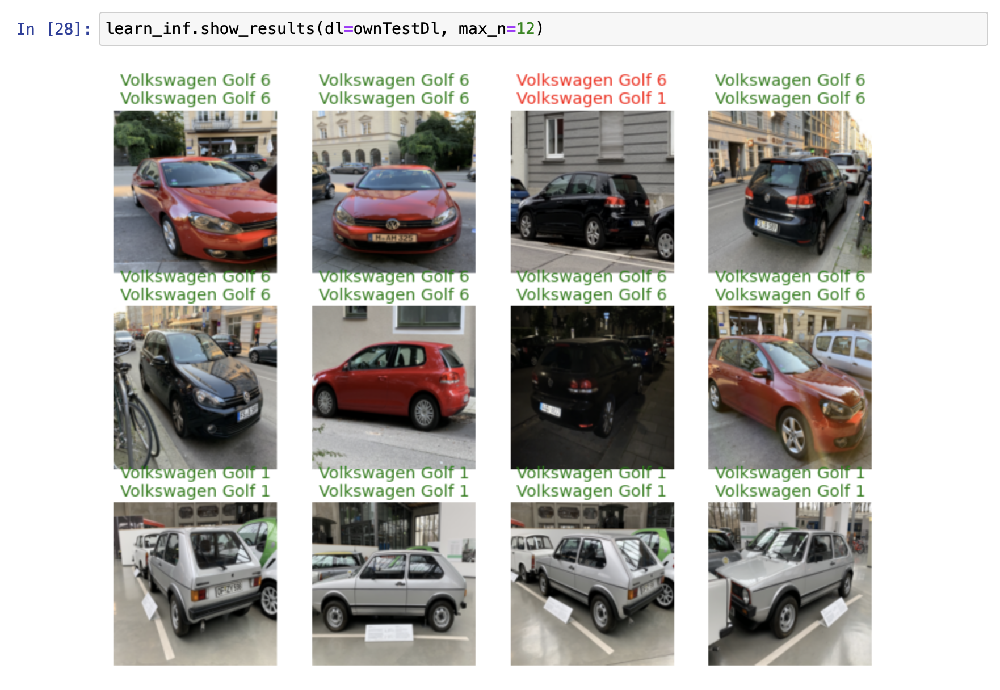

# Car classifier

Machine Learning project to classify car models by photos. Inspired by [fastai](https://www.fast.ai) course & code. So far this is just the first version and a proof of concept. Current version classifies cars by 8 categories, which represents 8 generations of Volkswagen Golf model.

*[**Try it!**](https://vw-golf-classifier.herokuapp.com) (on mobile or desktop)*

All parts of this application are written in python in form of [Jupyter Notebooks](https://jupyter.org). Further I will describe the main steps of this project and point out which notebooks are responsible for them.

## Data

### Gathering

##### ([GatherDataBing.ipynb](GatherDataBing.ipynb), [GatherDataDDG.ipynb](GatherDataDDG.ipynb))
Data for this project was collected from Internet. Partially using scripts and search engines (Bing & DuckDuckGo). But mostly by searching & downloading by hand.  
**1500** images there collected in total. Approximately **190** images per category (so far there are **8** VW Golf generations).
In addition, **67** photos were collected on the street with the iPhone camera.

*The training data is not a part of this repo.*

### Splitting
##### ([Split.ipynb](Split.ipynb))

The data was then split in 3 sets: training (67%), validation (19%) & test (14%).

## Training
##### ([Train.ipynb](Train.ipynb))
### Model

A pre-trained ResNet50 model was selected for the training. Then it was *fine tuned* using training data for **100** epochs using MacBook Pro (2018, i7, 16 GB) and only CPU (the training took about 6 hours). A standard set of augmentations from fastai library where applied to the training data.

You can download the model [here](https://drive.google.com/file/d/170T-MMyYRKQGUJF9z1RhLypIkvLoVZg-/view?usp=sharing).

### Accuracy

Validation set - **96%**  
Test set - **95%**  
Own iPhone photos taken on street - **88%**

### Example of predictions

## Application
##### ([Inference.ipynb](Inference.ipynb))

A web application is rendered from Jupyter Notebook using [Voilà](https://github.com/voila-dashboards/voila/) library.

### Deployment

 The Voila web application is deployed for free on [Heroku](https://www.heroku.com/) platform.  
 *The model is hosted on Google Drive and downloaded at runtime to bypass storage limits for free hosting.*

 ## Main dependencies
 - [fastai](https://docs.fast.ai)
 - [fastbook](https://github.com/fastai/fastbook)
 - [Jupyter Notebooks](https://jupyter.org)
 - [Voilà](https://github.com/voila-dashboards/voila/)
 - macOS